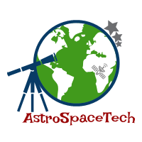

# AstroSpaceTech
## Client side code written by [XinYaanZyoy](https://xinyaanzyoy.github.io/THB)
### for Blog by @AstromuonKuki

Hi,
Thanks for looking about me.Hope everything is hunky-dory.I may not know you in personally but I could feel that you're such a curious person and trying hard enough to understand this cosmos.
Keep going on.Being thirsts in knowledge will enlighten yourself soon!
The world needs a person like you.
The world needs a dreamer like you.
The world needs a young man like you.
Keep hunting for unknown and travel with me throughout the cosmos.
Somewhere,something incredible is waiting to be known.
This blog is created to enlighten mainly about Astronomy/cosmology,
Aerospace engineering,
and
Technology.

The author of this blog have recently worked at SciComm (Science Company) as Educator(astronomy).He hails from North Eastern part  of India-Manipur.He loves space,stars,galaxies,nebulae,asteriods,comets and anything from the sky🌟🌠
Meantime,he is currently pursuing BTech in Aerospace engineering🚀✈🚠
(He loves to connect with like minded people around the globe)
N.B.If you like this blog, do share to your friends zone.

Thank you
